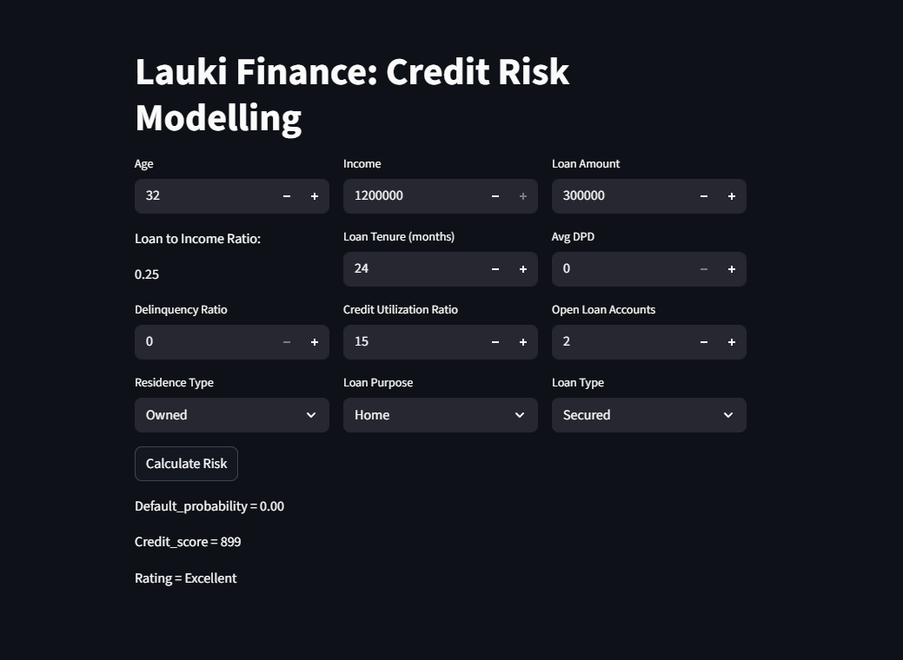
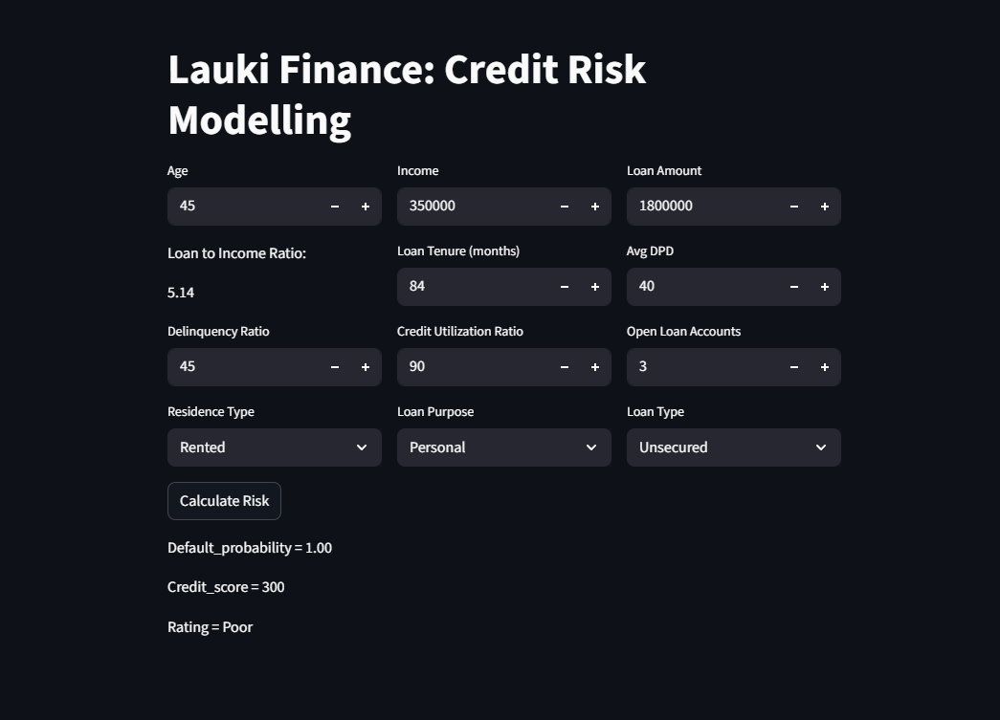

#  Credit Risk Modelling

An end-to-end Machine Learning application that predicts the probability of loan default using customer financial and credit history data. The application helps financial institutions assess an applicant's creditworthiness by estimating default risk, generating a credit score, and classifying applicants into different risk categories.

---

##  Overview

Credit Risk Modelling is one of the most important applications of Machine Learning in the banking and financial sector. This project predicts whether a loan applicant is likely to default based on financial and credit-related information.

The application also generates a credit score and classifies applicants into different risk categories, helping loan officers make faster and more informed lending decisions.

---

##  Features

- Predict Loan Default Risk
- Generate Credit Score
- Risk Tier Classification
- Interactive Streamlit Web App
- Real-Time Predictions
- User-Friendly Interface
- Machine Learning Based Decision Support

---

##  Input Features

The prediction is based on the following applicant information:

- Age
- Annual Income
- Loan Amount
- Loan Tenure
- Loan-to-Income Ratio
- Average Days Past Due (DPD)
- Delinquency Ratio
- Credit Utilization Ratio
- Open Loan Accounts
- Residence Type
- Loan Purpose
- Loan Type

---

##  Machine Learning Models

- Logistic Regression
- XGBoost Classifier

---

##  Model Evaluation Metrics

The models were evaluated using:

- AUC Score
- Gini Coefficient
- KS Statistic
- Recall

These metrics ensure reliable discrimination between default and non-default borrowers.

---

##  Tech Stack

### Programming Language
- Python

### Libraries
- Pandas
- NumPy
- Scikit-learn
- XGBoost
- Joblib

### Frontend
- Streamlit

### Version Control
- Git
- GitHub

---

##  Project Structure

```text
ML-project-credit-risk-model/
│
├── artifacts/
│   └── model_data.joblib          # Trained machine learning model
│
├── .idea/                         # IDE configuration files
├── __pycache__/                   # Python cache files
│
├── main.py                        # Streamlit application
├── prediction_helper.py           # Prediction logic and preprocessing
├── requirements.txt               # Project dependencies
├── README.md                      # Project documentation
└── .gitignore                     # Git ignore file
```

---

##  Application Preview

### Excellent Credit Applicant


- Low Loan-to-Income Ratio
- Strong Credit History
- Low Default Probability
- Excellent Credit Score

###  High Risk Applicant


- High Loan Burden
- Poor Repayment History
- High Credit Utilization
- High Default Probability

---

##  Business Impact

This application can help financial institutions:

- Reduce loan default risk
- Improve lending decisions
- Speed up applicant evaluation
- Provide consistent credit assessment
- Support data-driven decision making


---

##  Installation

Clone the repository

```bash
git clone https://github.com/Sehajvij8/ML-project-credit-risk-model.git
```

Move to the project directory

```bash
cd ML-project-credit-risk-model
```

Install dependencies

```bash
pip install -r requirements.txt
```

Run the application

```bash
streamlit run main.py
```

---

##  Project Highlights

- End-to-End Machine Learning Project
- Credit Risk Prediction
- Credit Score Generation
- Risk Tier Classification
- Streamlit Web Application
- Logistic Regression & XGBoost Models
- Real-Time Predictions

---

##  Author

**Sehaj Vij**

Aspiring AI Engineer | Machine Learning Enthusiast

- GitHub: https://github.com/Sehajvij8
- LinkedIN: https://www.linkedin.com/in/sehaj05

---

If you found this project helpful, consider giving it a star!